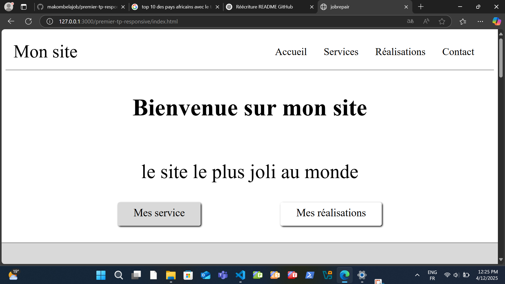

# 🔧 JobRepair

**JobRepair** is a modern, responsive landing page built with HTML5 and CSS3. It showcases a professional's or company's services, portfolio, and includes a fully structured contact section.

## 🌐 Live Preview

👉 [Insert your deployed site link here]

## 📸 Screenshots

*Add more screenshots if needed to show different sections of the site.*

## 🚀 Features

- Clean and responsive layout
- Mobile-first design with burger menu navigation
- Services and portfolio sections with images
- Functional contact form (static)
- Smooth user experience with clear content hierarchy

## 🛠️ Technologies Used

- HTML5  
- CSS3  
- Google Fonts (Roboto)  
- Responsive design with Flexbox/Grid  

## 📁 Project Structure

## ✏️ Sections Overview

- **Header**: Includes logo/title and burger menu navigation
- **Hero Section**: Introduction with a call-to-action
- **Services**: Four service cards with images and short descriptions
- **Portfolio**: Showcases completed projects
- **Contact**: Form with email input, subject dropdown, message box, and checkbox validation
- **Footer**: Simple footer with legal mentions link

## 📌 Future Improvements

- Add JavaScript for dynamic interactions (e.g., form validation, animations)
- Connect the form to a backend (PHP, Node.js, Formspree, etc.)
- Add SEO tags and Open Graph metadata
- Improve accessibility and ARIA support
- Translate to multiple languages

## 📬 Contact

Feel free to reach out via the contact form or directly by email:  
📧 **[makombelajob@gmail.com]**

## 🪪 License

This project is licensed under the [MIT License](LICENSE).

---

### ⭐️ Don't forget to give a star if you like this project!
